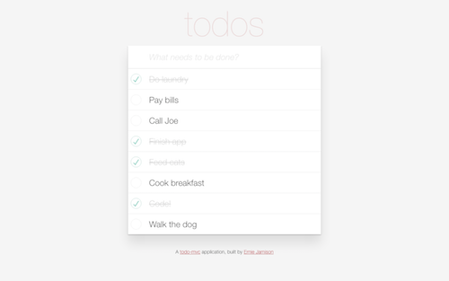

# Todo

A single page dynamic database driven todo application that doesn't need page refreshes between changes to the page.

Check out the live Todo application [here](https://todoit-ernie-jamison.herokuapp.com) and try it out.

### Features:

* Uses RESTFUL JSON APIs to fetch data from Rails.

* Javascript is used to dynamically update the page.

* jQuery allows users to toggle items as complete or not.

